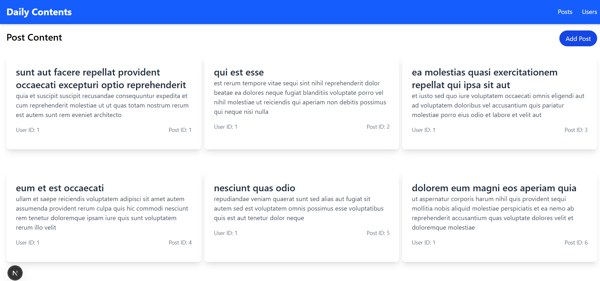
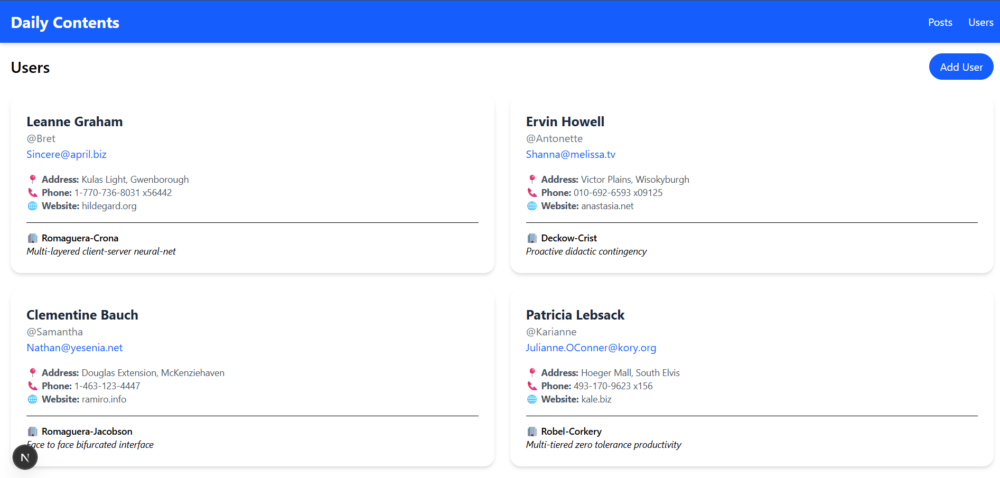
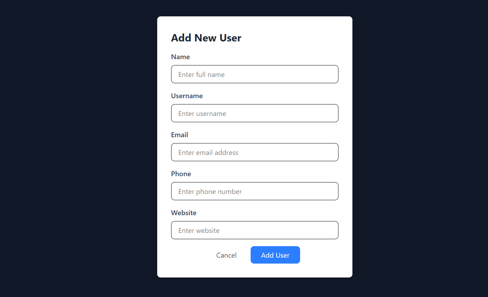

# React Architect: Mastering Advanced Structures in Next.js

## Project Description
This project is a comprehensive Next.js web application that demonstrates fundamental concepts of modern web development. The application features multiple pages for displaying posts and users, with interactive components for adding new content. Built with TypeScript, Tailwind CSS, and Next.js, the project showcases best practices in component-based architecture, state management, and API integration.

## 🛠 Tech Stack
- [Next.js](https://nextjs.org/) – React framework for SSR/SSG
- [TypeScript](https://www.typescriptlang.org/) – Type safety
- [Tailwind CSS](https://tailwindcss.com/) – Utility-first CSS
- [React Hooks](https://react.dev/) – State & side effects


### Project Structure

```
alx-project-0x01/
│
├── components/
│   ├── common/                # Shared reusable components
│   │   ├── PostCard.tsx       # Display a single post
│   │   ├── PostModal.tsx      # Add/Edit post modal
│   │   ├── UserCard.tsx       # Display a single user
│   │   ├── UserModal.tsx      # Add/Edit user modal
│   │   └── Button.tsx         # (Optional) shared button component
│   │
│   ├── layout/                # Layout components
│   │   ├── Header.tsx         # Navbar / Top navigation
│   │   └── Footer.tsx         # (Optional) footer
│
├── interfaces/                # TypeScript interfaces
│   └── index.ts               # PostProps, UserData, UserModalProps, etc.
│
├── pages/
│   ├── index.tsx              # Homepage
│   │
│   ├── posts/                 
│   │   └── index.tsx          # Posts listing page
│   │
│   ├── users/                 
│   │   └── index.tsx          # Users listing page
│   │
│   ├── _app.tsx               # Custom App (wrap pages with providers, layout, etc.)
│   └── _document.tsx          # Custom Document (HTML head, lang, etc.)
│
├── public/                    # Static assets (images, icons, etc)
│   ├──assets/images           # for Images
├── styles/                    
│   └── globals.css            # Tailwind CSS global styles
│
├── tsconfig.json              # TypeScript configuration
├── tailwind.config.js         # Tailwind configuration
├── postcss.config.js          # PostCSS config (for Tailwind)
├── package.json
└── README.md
```

## ⚙️ Installation

Clone the repository:
```bash
git clone https://github.com/your-username/your-repo.git
cd your-repo
```
Install dependencies:
```
npm install
# or
yarn install

```

 run the development server:

```bash
npm run dev
# or
yarn dev
# or
pnpm dev
# or
bun dev
```
open Browser
```
http://localhost:3000
```

## 📸 Screenshots of pages





## 📄 License
This project is licensed under the MIT License.

